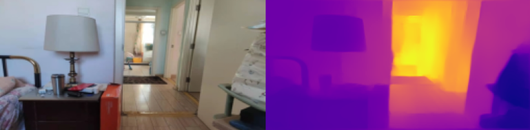

# MonoDepthEst

## Introduction📢

The project aims to implement a depth estimation system with a single camera, implemented with Keras.

To have an overview of the project, check the [poster](src/doc/Poster_desensitized.pdf) in the repository



## Preparation⚙

1. Make sure you have python development environment on your PC.

2. Before running the training and testing scripts, first run below command to install dependencies

      ```commonlisp
      pip install -r "requirements.txt"
      ```

   This project is tested with Keras 2.4.3 (tensorflow 2.3.0 as backend), CUDA 11.0, Python 3.6.7 on Ubuntu 18.04 and Windows 10

3. Download [Training & Testing Set and Trained Model](https://drive.google.com/drive/folders/1VK3gDkks7Rdm6tKRP3AodhZMMlU23o0P?usp=sharing) to the root directory (no need to extract) and corresponding folder

## Training⏳

- The model is trained on the platform with NVIDIA Tesla K80 GPU @ 240.48 GB/s 12GB, at the bs = 4
- Run `python train.py `, see more helping info with adding `-h` as an extra argument in CMD

## Evaluation & Prediction⚖

### Evaluation🥇:

- To evaluate the model run `python evaluate.py` , add `--model` to import your own trained model
- You will have the six evaluation criteria (threshold accuracies, average relative error, root mean squared error, average error): $\delta_1,\delta_2,\delta_3,rel,rms,log_{10}$

### Prediction 🖼:

- Run `python predict.py --input yourpic.jpg`
- Note: if you download the trained model, the detection range is limited to 10 meters

## Future Work📆

The project will be used in "Flea Market" project for indoor prediction and 3D reconstruction.


